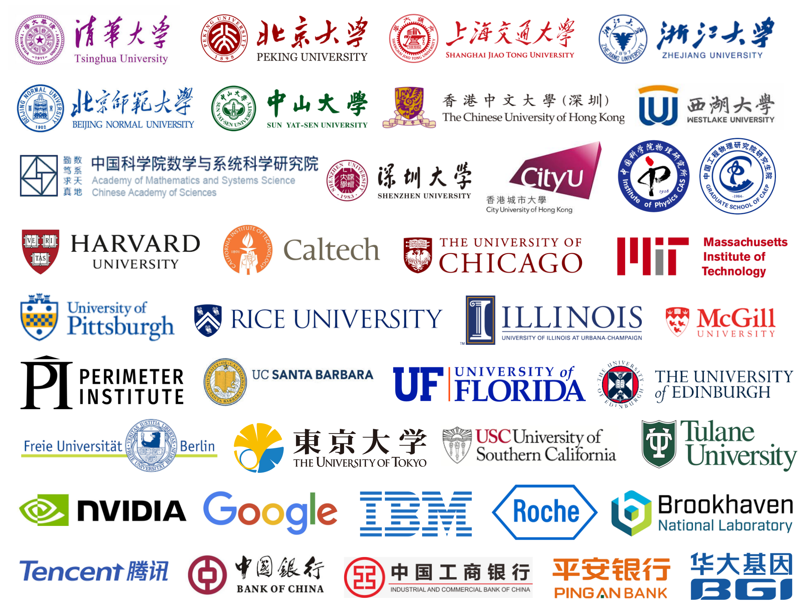

<h1 align="center"> TENSORCIRCUIT-NG </h1>

<p align="center">
  <!-- tests (GitHub actions) -->
  <a href="https://github.com/tensorcircuit/tensorcircuit-ng/actions/workflows/ci.yml">
    
  </a>
  <!-- docs -->
  <a href="https://tensorcircuit-ng.readthedocs.io/">
    
  </a>
  <!-- PyPI -->
  <a href="https://pypi.org/project/tensorcircuit-ng/">
    
  </a>
  <!-- License -->
  <a href="./LICENSE">
    
  </a>
</p>

<p align="center"> <a href="README.md">English</a> |  简体中文 </p>

TensorCircuit-NG 是下一代量子软件框架，完美支持自动微分、即时编译、硬件加速、向量并行化和分布式训练，是量超智融合的首选平台。

TensorCircuit-NG 建立在现代机器学习框架 Jax, TensorFlow, PyTorch 之上，支持机器学习后端无关的统一界面。 其特别适用于理想情况、含噪声情况、稳定子情况、可控近似情况、连续动力学情况及费米子情况下，大规模量子经典混合范式和变分量子算法的高效模拟。其可以高效地编织和模拟量子线路、张量网络和神经网络组成的混合计算图。

TensorCircuit-NG 现在支持真实量子硬件连接和实验，并提供优雅的 CPU/GPU/QPU 硬件混合部署训练方案。

TensorCircuit-NG 是目前积极维护的唯一官方版本，是 TensorCircuit 的[完全兼容](https://github.com/orgs/tensorcircuit/discussions/19)的升级版本，它包含了更多新功能（例如稳定子线路、多卡分布式模拟等）和错误修复（例如支持最新的 numpy>2 和 qiskit>1）。

## 入门

请从 [完整文档](https://tensorcircuit-ng.readthedocs.io/) 中的 [快速上手](/docs/source/quickstart.rst) 开始。

有关软件用法，算法实现和工程范式演示的更多信息和介绍，请参阅 100+ [示例脚本](/examples) 和 40+ [案例教程](https://tensorcircuit-ng.readthedocs.io/en/latest/#tutorials)。 [测试](/tests) 用例和 API docstring 也提供了丰富的使用信息。

TensorCircuit-NG 也支持 AI 原生编程资源：[Devin Deepwiki](https://deepwiki.com/tensorcircuit/tensorcircuit-ng) 和 [Context7 MCP](https://context7.com/tensorcircuit/tensorcircuit-ng).

初学者也可以参考[量子计算教程](https://github.com/sxzgroup/qc_lecture)学习量子计算基础和 TensorCircuit-NG 的典型用法.

以下是一些最简易的演示。

- 电路操作:

```python
import tensorcircuit as tc
c = tc.Circuit(2)
c.H(0)
c.CNOT(0,1)
c.rx(1, theta=0.2)
print(c.wavefunction())
print(c.expectation_ps(z=[0, 1]))
print(c.sample(allow_state=True, batch=1024, format="count_dict_bin"))
```

- 运行时特性设置:

```python
tc.set_backend("tensorflow")
tc.set_dtype("complex128")
tc.set_contractor("greedy")
```

- 使用即时编译 + 自动微分:

```python
def forward(theta):
    c = tc.Circuit(2)
    c.R(0, theta=theta, alpha=0.5, phi=0.8)
    return tc.backend.real(c.expectation((tc.gates.z(), [0])))

g = tc.backend.grad(forward)
g = tc.backend.jit(g)
theta = tc.array_to_tensor(1.0)
print(g(theta))
```

## 安装

该包是用纯 Python 编写的，可以通过 pip 直接获取：

```python
pip install tensorcircuit-ng
```

我们推荐安装时同时安装 TensorFlow，这可以通过以下安装可选项实现：

```python
pip install tensorcircuit-ng[tensorflow]
```

其他安装选项包括： `[torch]`, `[jax]`, `[qiskit]` 和 `[cloud]`。

此外我们有每日发布的最新版本 pip package，可以尝鲜开发的最新功能，请通过以下方式安装:

```python
pip uninstall tensorcircuit-ng
pip install tensorcircuit-nightly
```

我们也有 [Docker 支持](/docker)。

## 优势

- 基于张量网络模拟引擎

- 即时编译、自动微分、向量并行化兼容

- GPU 支持、量子硬件支持、混合部署方案支持

- 高性能原生，分布式多卡多节点支持

- 效率

  - 时间：与 TFQ, Pennylane, 或 Qiskit 相比，加速 10 到 10^6+ 倍

  - 空间：600+ qubits 1D VQE 工作流（收敛能量误差：< 1%）

- 优雅

  - 灵活性：自定义张量收缩、多种 ML 后端/接口选择、多种数值精度、多种量子硬件

  - API 设计：人类可理解的量子，更少的代码，更多的可能

## 贡献

### 现况

该项目由 [Shi-Xin Zhang](https://github.com/refraction-ray) 创造并维护。当前核心作者包括 [Shi-Xin Zhang](https://github.com/refraction-ray) 和 [Yu-Qin Chen](https://github.com/yutuer21)。我们也感谢来自开源社区的[贡献](https://github.com/tensorcircuit/tensorcircuit-ng/graphs/contributors)。

### 引用

如果该软件对您的研究有帮助, 请引用我们发表在 Quantum 期刊的白皮书文章来支持我们的研发付出。

[TensorCircuit: a Quantum Software Framework for the NISQ Era](https://quantum-journal.org/papers/q-2023-02-02-912/).

### 说明

有关贡献指南和说明，请参阅 [贡献](/CONTRIBUTING.md)。

我们欢迎大家提出 [issues](https://github.com/tensorcircuit/tensorcircuit-ng/issues), [PR](https://github.com/tensorcircuit/tensorcircuit-ng/pulls), 和 [讨论](https://github.com/tensorcircuit/tensorcircuit-ng/discussions)，这些都托管在 GitHub 上。

### 协议

TensorCircuit-NG 是基于 Apache License 2.0 的开源软件。

## 研究和应用

### DQAS

可微量子架构搜索的应用见 [应用](/tensorcircuit/applications)。

参考论文：https://arxiv.org/abs/2010.08561 (QST)。

### VQNHE

关于变分量子神经混合本征求解器的应用，请参见 [应用](tensorcircuit/applications)。

参考论文：https://arxiv.org/abs/2106.05105 (PRL) 和 https://arxiv.org/abs/2112.10380 。

### VQEX-MBL

VQEX 在 MBL 相位识别上的应用见 [教程](/docs/source/tutorials/vqex_mbl.ipynb)。

参考论文: https://arxiv.org/abs/2111.13719 (PRB)。

### Stark-DTC

数值验证 Stark 多体局域化稳定的离散时间晶体，类似的 Floquet 系统模拟请参考 [例子](/examples/timeevolution_trotter.py)。

参考论文: https://arxiv.org/abs/2208.02866 (PRL)。

### RA-Training

利用我们提出的随机量子门激活策略训练优化变分量子算法的实现请参考 [项目](https://github.com/ls-iastu/RAtraining).

参考论文: https://arxiv.org/abs/2303.08154。

### TenCirChem

[TenCirChem](https://github.com/tencent-quantum-lab/TenCirChem) 是高效的，专注于处理和计算分子性质的量子计算软件。其基于 TensorCircuit 并为量子化学任务进行了专门的优化。

参考论文: https://arxiv.org/abs/2303.10825 (JCTC)。

### EMQAOA-DARBO

数值模拟和带错误消除的真实量子硬件实验验证 QAOA 优化的代码请参考 [项目](https://github.com/sherrylixuecheng/EMQAOA-DARBO)。

参考论文: https://arxiv.org/abs/2303.14877。

### NN-VQA

关于神经网络编码的变分量子算法的实现和工作流, 见 [教程](/docs/source/tutorials/nnvqe.ipynb)。

参考论文: https://arxiv.org/abs/2308.01068。

### 变分多体态的等效温度

关于基于神经网络、张量网络和量子线路的变分量子态的模拟优化和分析，见 [项目](https://github.com/sxzgroup/et).

参考论文: https://arxiv.org/abs/2411.18921.

## 用户

我们的用户，开发者和合作伙伴：

<p align="center">
    
</p>
