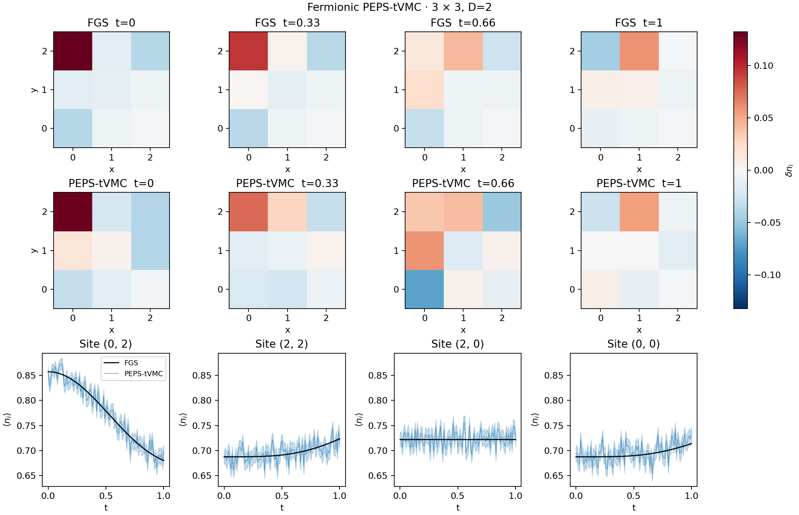

# Fermionic PEPS-tVMC

`run_peps.py` adds a sampled fermionic PEPS calculation of the same corner-potential
quench as the FGS example. The target is the algorithm behind published
Figure 2(b,c) of [PRX Quantum 7, 033035](https://doi.org/10.1103/tggc-8fjx).
The small lattices validate that algorithm; they cannot establish the paper's
large-system accuracy, efficiency, or separation of bulk and edge behavior.

## Reused implementations

| Component | Implementation |
| --- | --- |
| Fermion algebra and Jordan–Wigner mapping | TenCirPauli `FermionOperator.from_terms` and `map_fermions` |
| Connected Hamiltonian matrix elements | Public mapped `PauliTerm` / `PauliWord.to_codes` data |
| Exact sampled PEPS contraction | TensorCircuit-NG `Gate` and `tc.contractor` |
| Truncated boundary-MPS contraction | Existing `examples/peps_boundary_mps.py`: `peps_partition_function` and `apply_grid_row_dmrg` |
| Differentiation, vectorization, scans, linear algebra | `tc.backend` |
| Independent Gaussian reference | Existing `main.py` helpers and `tc.FGSSimulator` |
| Independent small-sector validation | TenCirPauli `ChargeSector`, native restricted Hamiltonian, and `backend_mvp` acting on a `tc.Circuit` state |

Neither repository currently supplies a complete fermionic PEPS-tVMC driver.
The example adds the parity-block tensor layout, sampled swap factors, local
hole environments, number-conserving Markov chains, and gauge-projected SR/RK4
composition needed for this paper. It does not implement another fermion
mapping, general tensor-network contractor, or eigensolver. Pauli terms are
used directly because full-state MVP plans require a representable Hilbert-space
dimension and therefore cannot be constructed for 144 modes.
TensorCircuit's existing `experimental.qng` consumes a full state vector;
it does not supply the sampled PEPS covariance or gauge projection needed here.

## Run

Use a dedicated environment with the dependencies of the FGS example and
**TenCirPauli 0.5.0**. The PEPS example uses JAX and complex128. From the
repository root, include `examples` on the import path so the existing
boundary-MPS example is importable:

```bash
PYTHONPATH=.:examples python examples/reproduce_papers/2026_chern_edge_fgs/validate_peps.py
PYTHONPATH=.:examples python examples/reproduce_papers/2026_chern_edge_fgs/run_peps.py
PYTHONPATH=.:examples python examples/reproduce_papers/2026_chern_edge_fgs/validate_peps.py \
  --result-dir examples/reproduce_papers/2026_chern_edge_fgs/outputs
```

`--output-dir` selects a separate run directory. The default is the existing
example's `outputs` folder. The run writes a figure, numerical arrays, a compact
metrics JSON, and an initial-state checkpoint. `--initial-state` reuses that
VMC-prepared state for time-step or sample-count comparisons. It does not fit
the PEPS to the Gaussian solution.

The default is a small 3 x 3, D=2 demonstration: 400 preparation steps of
size 0.02, followed by 100 real-time steps of size 0.01, ending at t=1.
Each stage uses 256 chains with four draws (1,024 samples) and two sweeps
between draws. Preparation and evolution took 152 and 53 seconds, including
JIT compilation, on an eight-core CPU allocation, with 755 MiB peak RSS.
This is the run shown below. Timings depend on the environment.

The recorded long 3 x 3 run reuses the initial state from a 64-chain,
64-draw preparation. To reproduce that two-stage sequence, first run with
`--chains 64 --draws 64 --prepare-steps 600 --time 1
--output-dir <preparation-directory>`, then run with
`--draws 16 --time 12
--initial-state <preparation-directory>/peps_initial_state.npz`.
This longer validation is optional; it is not needed to run the example.



## Algorithm and conventions

The rectangular open lattice retains unit hopping, vertical hopping phase
`exp(-2j*pi*x/3)`, filling 2/3, and a pinning potential of -1 on the upper-left
corner. The site order is `i = y*columns+x`, with y increasing upward. An even
particle number is required by this even-parity ansatz.

Each virtual index has parity `index % 2`. Only entries with even total physical
and virtual parity are parameters. Physical legs leave toward the upper left,
crossing the upward virtual bonds to their left. The resulting sampled swap
factors implement the fermionic PEPS construction of
[arXiv:2506.20106, Eqs. (2), (3), and (8)](https://arxiv.org/abs/2506.20106),
reflected vertically to match this coordinate convention. Particle number is
projected by restricting the sampled configurations; it is not inferred from
the parity symmetry alone.

Random nearest-neighbor occupation exchanges preserve particle number.
Metropolis acceptance uses the squared PEPS amplitude. Independent chains are
carried through all RK4 stages, with additional transitions before each estimate.
On small lattices, identical sampled configurations are coalesced with their
observed multiplicities. Production code never enumerates the Fock basis.

Ground-state preparation uses imaginary-time SR with the pin present. Real-time
evolution removes the pin and multiplies the SR direction by `-i`. Both use RK4.
For scores O and local energies E, standard SR solves the centered covariance
equation `S v = F`, projected orthogonally to parity-preserving virtual gauge
directions, global scale, and the fixed-number scale. The regulator is 1e-4
during preparation and 1e-8 during real-time evolution.

This compact implementation constructs the gauge projector with a
rank-revealing SVD of the analytical generators and uses a positive Cholesky
solve on `P S P + lambda P + I-P`. The paper instead constructs a reduced
coordinate basis with QR and exploits locality more extensively. The full
parameter-space projector used here does **not** reproduce that computational
speedup. The reported SR residual is the squared relative residual of the
unregularized centered equation, as in the paper's Eq. (26).

`--solver minsr` also implements the **published, uncentered** sample-space
Eq. (17), including the real-time factor from Eq. (18). It is intended for
fewer sampled rows than parameters; it is not the centered formula in earlier
preprint versions. The standard SR workflow is the main small-system example.

Without `--boundary-dim`, each sampled network is contracted exactly with
TensorCircuit. With a finite cap, the existing variational boundary-MPS
contractor uses two sweeps per row. Logarithmic derivatives then use local hole
environments, following Eq. (12) of arXiv:2506.20106, instead of differentiating
through a nonholomorphic compression algorithm. Finite-cap energies and scores
must be checked for convergence in that cap.

## Validation and interpretation

`validate_peps.py` checks the literal fermionic swap network, local energies
against TenCirPauli's independent native sector Hamiltonian, full-state MVP
basis conventions, finite-difference derivatives, gauge null directions, SR
and minSR residuals, Born sampling, boundary-MPS convergence, and RK4 against
exact Schrödinger evolution. Full Fock-space operations are confined to this
validation script.

The deterministic RK4 check at t=0.04 gives phase-aligned state errors of
2.80e-8 and 1.78e-9 for time steps 0.01 and 0.005. A 3 x 4, D=2 boundary test
reduces amplitude/score relative errors from approximately 0.50/0.45 at cap 2
to 3.31e-14/5.62e-16 at cap 4. These checks demonstrate why a small SR residual
alone is insufficient to certify the physical result.

For a saved small run, `--result-dir` independently measures preparation energy
error, variance and infidelity, final-state infidelity relative to exact
evolution from the **prepared** state, exact PEPS energy drift, and density
errors. The scaled benchmark also requires initial energy error below 1e-6
and phase-aligned evolution-state error below 1e-4, independently of whether
the sampled curves look close. The FGS reference starts from its independently
computed exact ground state, so comparison with it includes preparation error.

The default 3 x 3, D=2, 1,024-sample run passes both bounds: initial energy
error is 6.14e-9 and phase-aligned evolution-state error is 1.59e-8. Exact
PEPS energy drift is -2.01e-10, and final exact density error relative to FGS
is 1.90e-5. The plotted Monte Carlo density has RMSE 0.0152, dominated by
measurement sampling; this is distinct from the error in the evolved PEPS.

Additional, longer checks at 4,096 samples per stage give:

| Lattice / D | Final time | Initial energy error | Initial infidelity | Exact PEPS energy drift | Final exact density error vs FGS |
| --- | --- | --- | --- | --- | --- |
| 2 x 3 / 2 | 12 | 7.64e-11 | 7.47e-11 | 8.76e-10 | 2.99e-6 |
| 3 x 3 / 2 | 1 | 5.27e-13 | 4.53e-13 | -6.65e-10 | 1.88e-7 |
| 3 x 3 / 2 | 12 | 5.27e-13 | 4.53e-13 | 4.70e-7 | 7.55e-7 |

Here each SR stage uses 4,096 samples and time step 0.01. Final-state
infidelity relative to exact evolution from the prepared state is below 1e-14
in the first two runs. The 3 x 3 extension to t=12 has evolution infidelity
1.89e-11 and phase-aligned state error 4.35e-6. These are favorable small-system
checks, not an accuracy claim for larger PEPS. The sampled density RMSE is
about 0.0075 and dominates the plotted error. In a controlled 2 x 3, t=1
comparison from the same prepared state,
increasing samples from 1,024 to 4,096 reduces density RMSE from 0.0143 to
0.00745. Halving the time step at 4,096 samples gives RMSE 0.00742; measurement
noise dominates that comparison, whereas the deterministic RK4 test above
isolates integration order.

To repeat the sample-count and time-step comparisons, prepare a 2 x 3, D=2
checkpoint with `--rows 2 --columns 3 --chains 64 --draws 64
--prepare-steps 600`. Reuse it with
`--initial-state <checkpoint> --rows 2 --columns 3 --time 1 --chains 256`
and separate output directories for `(draws, dt) = (4, 0.01), (16, 0.01),
(16, 0.005)`. All reported runs use seed 17.

For the 2 x 3 bond-dimension check at 4,096 samples, D=4 gives initial energy
error 6.38e-10 and evolution-state error 3.40e-9 at t=1. Both D=2 and D=4
pass the stated bounds; sampled density RMSE is 0.00745 and 0.00767,
respectively. Increasing D is unnecessary at this tiny size and sample budget.

An exploratory **3 x 3, D=4, 2,048-sample** run does **not** pass the same
validation: initial energy error is 1.71e-4, evolution-state error is 0.0447,
and exact PEPS energy drift is 0.00472 by t=1. Its sampled SR residual remains
below 5e-18, demonstrating that this residual cannot certify physical accuracy.
The sampled final preparation variance (8.12e-8) also badly underestimates the
independently evaluated variance (8.55e-4). Exact enumeration of this saved
state identifies four rare configurations carrying total probability 6.32e-5
but 99.993% of its energy variance. A 2,048-sample independent Born batch
contains only 0.129 such configurations on average. Even independent sampling
can therefore miss the dominant contributions: 1,000 independent diagnostic
batches give a median variance estimate of 5.74e-8. This directly explains
the misleading sampled convergence signal; increasing D has not resolved the
preparation or evolution error. The exploratory run is not used for the
gallery figure. A larger-D accuracy claim would require renewed sampling and
preparation convergence checks.

Shaded bands show one standard error computed from independent chain means.
They account for variation within the sampled measurement blocks, but do not
include accumulated noise in the variational parameters, ansatz bias, or
boundary truncation error. Density maps use a symmetric signed color scale
and preserve all values; the original FGS figure retains the manuscript's
0 to 0.04 display range.
The optional longer run shows finite-size recurrences over t=0..12. Its four corner
sites differ from the paper's marked sites, and its pulse profile and speed
are not quantitatively matched to the original 12 x 12 figure.

## Larger lattices

The same executable can measure the current implementation's kernels without
launching a long ground-state preparation:

```bash
PYTHONPATH=.:examples python examples/reproduce_papers/2026_chern_edge_fgs/run_peps.py \
  --rows 6 --columns 6 --bond-dim 2 --boundary-dim 8 \
  --chains 4 --draws 1 --profile --output-dir <profile-directory>
PYTHONPATH=.:examples python examples/reproduce_papers/2026_chern_edge_fgs/run_peps.py \
  --rows 12 --columns 12 --bond-dim 4 --boundary-dim 16 \
  --chains 2 --draws 1 --solver minsr --profile --output-dir <profile-directory>
```

The published Chern run uses 12 x 12 sites, 96 particles, D=4, boundary cap 16,
40,960 samples, time step 0.01, and final time 12. Its production-scale trajectory
is outside this small-system example's scope; the profiles below only assess
the cost of individual kernels.

Measured steady kernel times on an eight-core CPU allocation are shown below.
Each entry is the time for the **whole indicated batch**, after one warm-up;
peak RSS includes all four kernels and their compilation. The inputs are
generic random parity tensors, not optimized ground states.

| Lattice / D / cap | Batch | Amplitudes | Scores | Local energies | One MC proposal | Peak RSS |
| --- | --- | --- | --- | --- | --- | --- |
| 6 x 6 / 2 / 8 | 4 | 0.0252 s | 0.0547 s | 2.00 s | 0.0538 s | 815 MiB |
| 12 x 12 / 4 / 16 | 2 | 0.607 s | 2.17 s | 354 s | 1.34 s | 2,987 MiB |

These are contraction/sampling profiles, **not complete SR or RK4 steps**.
In addition, one dense complex128 matrix of size 28,224 squared needs about
11.9 GiB; the current parameter-space SR constructs several such matrices.
The full published trajectory has not been run with this implementation.

The main remaining scaling bottleneck is that each connected hopping
configuration is contracted separately. A production-scale implementation needs
shared environments for local proposals and local energies, batched memory
management, and the paper's reduced/local gauge construction before attempting
an equally sampled 12 x 12 trajectory. Kernel profiles alone do not validate
large-lattice tVMC accuracy or demonstrate the paper's speedup.
