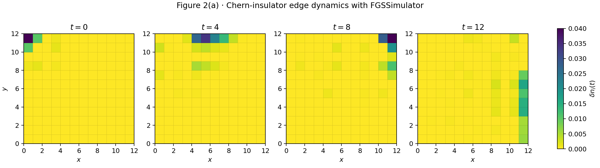

# Chern-insulator edge dynamics with FGSSimulator

This example reproduces **published Figure 2(a)** of Yantao Wu and Jannes Nys,
[*Real-Time Dynamics in Two Dimensions with Tensor Network States via
Time-Dependent Variational Monte Carlo Method*](https://journals.aps.org/prxquantum/abstract/10.1103/tggc-8fjx),
PRX Quantum **7**, 033035 (2026), published 19 August 2026
([arXiv:2512.06768](https://arxiv.org/abs/2512.06768)).

The contribution is an **FGS example**: `tc.FGSSimulator` prepares and evolves
a fixed-number fermionic Gaussian state using polynomial-size matrices.
Figure 2(a) is the paper's exact free-fermion benchmark; its PEPS-tVMC
algorithm and other panels are outside this example's scope.

## Run

Use an environment containing TensorCircuit-NG, JAX with CPU support, NumPy,
SciPy, and Matplotlib. From the repository root:

```bash
PYTHONPATH=. python examples/reproduce_papers/2026_chern_edge_fgs/main.py
PYTHONPATH=. python examples/reproduce_papers/2026_chern_edge_fgs/validate.py
```

Both scripts use JAX and `complex128`. Their default output directory is
relative to the script, so an installed checkout can also run them from
another working directory. `--output-dir <directory>` overrides that location;
pass the same location to both scripts.

The outputs are `result.png`, `densities.npz` (times, densities, the reference
density, and signed density deviations), and `results.json`.
`validate.py` checks the results with NumPy assertions and prints a success
message; it exits with an assertion failure if a numerical check fails.



## Model and conventions

The lattice is the original **12 x 12** open square with **96 particles**,
unit hopping, and flux magnitude $2\pi/3$. With $x$ increasing rightward and
$y$ upward, site $(x,y)$ has index $12y+x$. The physical Hamiltonian is

$$
\widehat H_0=-\sum_{x,y}\left(c^\dagger_{x,y}c_{x+1,y}
+e^{-i2\pi x/3}c^\dagger_{x,y}c_{x,y+1}+\mathrm{H.c.}\right),
$$

where only bonds inside the square are included. The initial state is the
96-particle ground state of $\widehat H_0-n_{0,11}$. At $t=0$ the corner
potential is removed. The plotted observable is
$\delta n_i(t)=\langle n_i(t)\rangle-\langle n_i\rangle_{\mathrm{gs}}$,
where the reference is the **96-particle ground state of $\widehat H_0$**.
The negative Peierls exponent follows the **published** Sec. IV A;
arXiv v2 instead prints a positive exponent.

Three FGS conventions matter:

1. `hopping` and `chemical_potential` produce
   $h_{\mathrm{FGS}}=\tfrac12\operatorname{diag}(h,-h^T)$ for
   $\widehat H=c^\dagger h c$, up to a constant. Physical time $t$ therefore
   requires `sim.evol_hamiltonian(2 * t * h_fgs)`.
2. `get_cmatrix()` returns
   $C=\langle(c,c^\dagger)(c^\dagger,c)\rangle$.
   Its lower-right block is $\langle c_i^\dagger c_j\rangle$;
   its diagonal gives the particle density.
3. `fixed_number_alpha` diagonalizes the single-particle initial Hamiltonian
   and explicitly fills its lowest 96 orbitals. If $U_o$ and $U_e$ contain
   occupied and empty eigenvectors, respectively, it supplies
   $\alpha=\operatorname{diag}(U_e,U_o^*)$ to `FGSSimulator`.
   This rectangular block matrix has shape $288\times144$ and satisfies
   $C=\alpha\alpha^\dagger$.

The simulation evolves this Gaussian representation with `tc.backend.jit`.
It never constructs a $2^{144}$-component state vector. Each requested time
is evaluated directly from the same initial state by a matrix exponential,
without a time-step approximation. NumPy and SciPy are used for file/plot
handling and the independent validation; the FGS workflow uses `tc.backend`.

## Validation and comparison

`validate.py` independently assembles a $144\times144$ single-particle
Hamiltonian, fills 96 orbitals with SciPy, and evolves
$\rho(t)=e^{-iht}\rho(0)e^{iht}$. It compares **all entries** of the Nambu
correlation matrix, the reference density, and the saved plotted arrays.
It also checks the oriented plaquette phase, particle number, energy,
Hermiticity, and pure-state projector identity $C^2=C$.

A separate four-mode check constructs fermionic operators in Fock space,
finds the fixed-number ground state, and evolves a `tc.Circuit`. Its complete
one-body correlations test complex hopping and basis conventions. An analytic
two-mode $\sin^2(t)$ oscillation checks the physical time factor explicitly.

In the recorded CPU run, the full-size correlation difference from SciPy was
$1.42\times10^{-14}$, particle-number error $2.84\times10^{-14}$, energy drift
$8.53\times10^{-14}$, and projector error $1.67\times10^{-15}$.
The four-mode Fock-space comparison differed by $1.11\times10^{-15}$.

At $t=0,4,8,12$, the peak positions (zero-based site coordinates) are
$(0,11)$, $(5,11)$, $(11,11)$, and $(11,6)$: along the upper edge to the right,
then down the right edge, matching the published figure's propagation pattern.
The original system size, filling, pinning strength, and times are retained.

The figure deliberately uses the paper's common **0 to 0.04** color range.
Negative deviations and peaks exceeding 0.04 saturate on this display;
`densities.npz` preserves them without clipping. In particular, the initial
corner excess is approximately 0.14038, with compensating negative density
elsewhere and zero net excess particle number. Axis labels and the color-bar
placement differ from the manuscript, and its site markers for panel (c)
are omitted.

The [author's cited public data directory](https://github.com/yantaow/open_data/tree/main/wu2025real-time)
contains linear-solver comparison data, with no Figure 2 density arrays found
at the time of reproduction. Agreement with the manuscript is therefore a
**visual comparison**; the numerical errors above compare independent
calculations, not unpublished author arrays.

The final four-core CPU run took about 8 seconds for calculation including
JIT compilation, about 16 seconds including process startup and plotting,
and about 0.51 GiB peak resident memory. Timing is environment dependent.
The recorded environment used Python 3.12.3, TensorCircuit-NG 1.9.1,
JAX/JAXlib 0.9.1, NumPy 2.4.3, SciPy 1.17.1, and Matplotlib 3.10.8.

Both example scripts passed Black and the repository's Pylint rules.
The existing `tests/test_fgs.py` suite passed all 41 tests in the separate
test environment. Pylint classifies `tensorcircuit` as a third-party import so
standalone examples use the same import order from any working directory.
The gallery taxonomy adds `fermionic-gaussian-state` because it previously
had no feature identifying `tc.FGSSimulator`.
