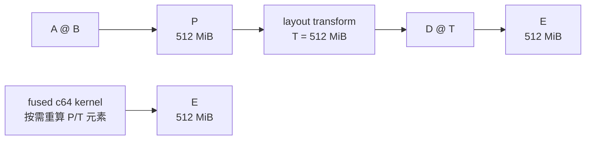

# TensorCircuit-NG BF16 Phase 0 评审讲义

面向读者：熟悉 TC-NG、JAX 或 GPU 计算，但没有参与本轮研究的评审人

预计阅读时间：15–20 分钟

日期：2026-07-27

## 先读这一页：评审结论是什么

这轮工作研究的是：**TC-NG 的大规模张量收缩能否利用 BF16 或 kernel fusion，显著降低 GPU 显存并提高速度，同时保持可接受的 complex64 输出精度。**

截至目前，最恰当的评审结论是：

> 接受 Phase 0 已得到的研究事实，但不批准进入 Phase 1。BF16 候选仍有希望；当前 direct region-fusion 实现应判定为不可行；整个 Phase 0 因两条候选路线和 whole-chain 证据尚未闭环而保持 INCONCLUSIVE。

用更直接的话说：

- 我们已经证明“这里确实有很大的显存可省”，不是纸面推算。
- 我们已经看到 BF16 vendor-kernel 路线有 3–8 倍量级的局部性能潜力。
- 我们也已经淘汰了一个看似很漂亮的方案：direct region fusion 虽然省了 1 GiB，却太慢，而且局部数值误差稳定超标。
- planar BF16 与 CUTLASS fallback 还没有完成最关键的极端数值测试，所以现在不能说它们可用，也不能说它们不可用。
- 目前没有任何生产代码或用户 API 获准落地；Phase 1 仍是 `NOT_AUTHORIZED`。

当前路线状态：

| 路线 | 它利用什么 | 当前状态 | 一句话原因 |
|---|---|---|---|
| planar BF16 | 把复数拆成实部/虚部，用 BF16 Tensor Core | UNKNOWN | 能运行且快，但缺少 cancellation 精度矩阵 |
| grouped GEMM | 一次提交多个不同形状的 GEMM | NOT_VIABLE | 目标平台缺少所需的异构 planar-complex grouped API |
| direct region fusion | 保持 c64，不写出两个巨大中间量 | NOT_VIABLE | 省 1 GiB，但 18/18 精度单元失败，且约慢 200 倍 |
| CUTLASS SM80 fallback | 在 sm_120 GPU 上运行兼容的 BF16 kernel | UNKNOWN | 能运行且单点快，但缺少完整 9-cell 精度矩阵 |

## 1. 为什么 TC-NG 要研究这件事

TensorCircuit-NG 是面向量子线路、张量网络和量子经典混合计算的高性能框架。JAX、TensorFlow 或 PyTorch 后端会把线路模拟转成一系列张量收缩；在 GPU 上，这些收缩最终大量表现为 GEMM、reshape 和 transpose。

对大规模模拟而言，显存经常比理论 FLOPs 更早成为限制：

- 一个 `complex64` 元素由两个 FP32 分量组成，占 8 字节。
- 状态或中间张量的元素数通常随量子比特数指数增长。
- 收缩路径中的临时张量可能比最终 state 更大。
- layout transform 如果不能与上下游算子融合，可能再产生一份同样大的 buffer。

本轮代表性 workload 是参数化量子线路在 `n=22/24`、depth 10 下的 JIT 收缩。它不是 TC-NG 所有 workload 的性能承诺，而是用于回答“现有执行图中是否存在值得优化的大型、真实、稳定中间量”。

以 `n=24` 为例，complex64 state 本身是：

```text
2^24 elements × 8 bytes = 128 MiB
```

但我们在优化后的 HLO 中观察到 512 MiB 的物化收缩中间量，整个执行峰值约 1.06 GiB。也就是说，优化中间收缩确实可能比只压缩最终 state 更有价值。

## 2. 两类不同的优化杠杆

这一点最容易被误解：Phase 0 同时研究了 BF16 和 region fusion，但二者不是同一种方案。

### 2.1 BF16/planar：减少每个复数的表示和计算成本

常用 GPU 框架没有可直接用于该任务的 complex-BF16 类型。planar 路线把复数拆为实部和虚部：

```text
A = Ar + iAi
B = Br + iBi

Re(A@B) = Ar@Br - Ai@Bi
Im(A@B) = Ar@Bi + Ai@Br
```

这通常需要四个实数 GEMM，但每个 GEMM 可使用 BF16 Tensor Core。若结果以两个 BF16 plane 保存，每个复数等价占 4 字节，而不是 complex64 的 8 字节。

它的潜在收益是：

- 输入/中间量约减半；
- 可使用 GPU 的 BF16 Tensor Core；
- 某些真实 GEMM 形状比 complex64 kernel 快数倍。

它的风险是：

- BF16 只有 7 个显式尾数位，舍入误差更大；
- 四次实数 GEMM 和组合会改变误差传播；
- 小而瘦的 GEMM 不一定比 c64 快；
- 如果 API 最终强制立即解码回 complex64，最终输出仍有 8 字节/元素的存储下限。

### 2.2 region fusion：保持 complex64，但不把中间量写入全局显存

region-fusion prototype 不是 BF16 kernel。它的输入、输出和内部标量都是 complex64/FP32。它节省显存的方式是把多步计算合并，在需要中间元素时现场重算，而不是保存完整的 `P` 和 `T`。

本次 anchor 是：

```text
P = A[4096,1024] @ B[1024,16384]  -> c64[4096,16384]  = 512 MiB
T = layout_transform(P)           -> c64[64,1048576]  = 512 MiB
E = D[64,64] @ T                  -> c64[64,1048576]  = 512 MiB
```



materialized 路径依次产生 `P`、`T` 和 `E`；fused 路径只保留输入、有限 workspace 和 `E`。它绕过中间量的收益与 BF16 的每元素压缩收益可以独立存在，未来也可能组合，但本轮没有证明这种组合。

## 3. Phase 0 到底在审查什么

Phase 0 是证据和可行性门，不是生产特性开发。研究代码主要位于 `results/_phase0/`，尚未改变 TC-NG 的公共 API 或默认执行路径。

四组问题可以用普通语言理解：

| 门控 | 它问的问题 |
|---|---|
| C1：materialization | 大 tensor 是否真的存在，还是已被 XLA 融掉？ |
| C2：memory leverage | 候选 kernel 在真实执行范围内是否真的降低峰值？ |
| C3：kernel capability | cuBLASLt/CUTLASS 能否覆盖真实收缩形状并带来速度优势？ |
| numerical | 结果是否在预先约定的输入分布和误差阈值下可靠？ |

一条路线只有在 capability、numerical 和 evidence binding 都通过时，才能称为 `VIABLE`。

Phase 0 只有在所有 required criterion 都得到确定结果后才能 `COMPLETE`。这里“确定结果”包括 PASS、FAIL 和 NOT_SUPPORTED；UNKNOWN 才会保持 INCONCLUSIVE。

因此：

```text
COMPLETE + 至少一条 VIABLE -> GO_TO_PHASE1
COMPLETE + 没有 VIABLE      -> NO_GO
存在 UNKNOWN                -> NOT_AUTHORIZED
```

## 4. 实验平台与适用边界

| 项目 | 环境 |
|---|---|
| GPU | RTX 5070 Ti Laptop GPU |
| 架构 | Blackwell `sm_120`，46 SM |
| 显存 | 约 12.8 GB |
| CUDA | 12.8 |
| PyTorch | 2.11.0+cu128 |
| JAX / jaxlib | 0.6.2 |
| cuBLAS | 12.8.4.1 |
| CuPy | 14.1.1 |
| TF32 | 关闭 |

评审时应把结果理解为“该硬件和工具链上的路线筛选”，不是跨 GPU 世代的普遍结论。尤其 native SM120 CUTLASS 的限制与当前 CUTLASS revision 和 CUDA 工具链相关。

## 5. 关键发现一：确实有大中间量可优化

C1 使用动态线路参数，避免 XLA 常量折叠；同时检查 optimized HLO、buffer assignment、执行成功和重复稳定性。

| Workload | state 大小 | 最大物化收缩 buffer | 执行峰值 | 判定 |
|---|---:|---:|---:|---|
| `n=22, depth=10` | 32 MiB | 128 MiB | 256.08 MiB | PASS |
| `n=24, depth=10` | 128 MiB | 512 MiB | 1056.17 MiB | PASS |

关闭 fusion 后峰值只变化约 0.02%–0.09%。这说明简单切换 XLA fusion 选项不能解决问题，也说明后续 kernel 工作不是在优化一个已被编译器消除的中间量。

评审含义：**可以接受“显存问题真实存在”这一研究前提。**

## 6. 关键发现二：planar BF16 很有潜力，但还不能签字

planar capability 测试覆盖八种来自 contraction graph 的代表形状，以及两种输出格式、四种 workspace cap 和转置模式，共 128 个配置单元。

结果：

- 120/128 配置找到并运行了算法；
- 四个最接近常规 GEMM、最适合 Tensor Core 的形状全部通过能力 quorum；
- 它们相对 resident-data c64 kernel 的速度比约为 3.31×、4.60×、4.75× 和 7.77×；
- 部分极瘦 GEMM 只有 0.79×–0.91×，说明 BF16 并非全形状自动加速。

为什么仍是 UNKNOWN？

完整 numerical matrix 应覆盖：

```text
8 shapes × 2 output modes × 3 profiles × 3 seeds = 144 cells
```

其中 baseline 与 mixed-scale 已有 96 个有效 cells；新的 `cancellation_v2` 仍缺 48 个。仓库中还有 48 个旧 cancellation rows，但它们来自旧输入构造，不能替代 v2。

评审含义：**能力和性能证据足以支持继续测量，不足以支持生产可行性结论。最优先的下一步应是补齐这 48 cells。**

## 7. 关键发现三：grouped 路线在当前平台不成立

同形状 batched GEMM 可以运行，但真实 contraction graph 包含多种不同形状，需要异构 grouped GEMM。

当前平台的 cuBLASLt 头文件没有项目所需的 grouped-3GEMM descriptor API；旧版 grouped batched API 又不能表达 planar-complex 的 plane-offset layout。强行退回四组独立实数调用会失去 grouped/planar 融合的核心收益。

评审含义：**`grouped = NOT_VIABLE` 是一个确定的、平台相关的负结果，不应继续保持 UNKNOWN。**

## 8. 关键发现四：CUTLASS fallback 值得继续，但 native SM120 不可混用

当前 CUTLASS native SM120 BF16 4M 构建路径无法编译：builder 只支持特定低精度格式，且没有匹配的 BF16 MMA。因此 native SM120 criterion 是 `NOT_SUPPORTED`。

另一个独立实现使用 SM80-compatible kernel，在 sm_120 GPU 上能够编译和执行：

| 指标 | 结果 |
|---|---:|
| 单点 correctness，3 seeds 最大相对误差 | 6.55e-5 |
| BF16 kernel-only | 3.217 ms |
| c64 baseline | 16.911 ms |
| 速度比 | 5.26× |
| workspace | 0 B |

但这只是 capability/单点 correctness。完整路线还需要 baseline、mixed-scale、cancellation 三个 profile × 三个 seeds，共 9 cells；当前 canonical aggregate 对这 9 cells 的有效覆盖是 0。

评审含义：

- 可以接受 SM80 fallback 的 capability PASS；
- 不可以用 fallback 证据把 native SM120 标成 PASS；
- 不可以用 3-seed 单点 correctness 把完整 numerical route 标成 PASS。

## 9. 关键发现五：region fusion 的显存收益是真的

full-anchor c64 prototype 在同一范围比较 materialized 与 fused 路径：

| 路径 | allocator peak |
|---|---:|
| materialized | 1696 MiB |
| fused direct | 672 MiB |
| 下降 | **1024 MiB** |

fused kernel 没有分配完整 `P` 和 `T`，各避开 512 MiB。1 GiB 差值与两个 buffer 的大小完全一致。

这项结果回答的是：

> 对这个局部两阶段 region，如果有一个合格的 fused kernel，避免物化 `P/T` 是否真能省显存？

答案是肯定的。

但它没有回答：

> 只替换完整 TC-NG contraction chain 中的这一个 region，整个程序峰值是否也会下降 1 GiB？

生产 HLO 的 live-range 分析显示，单独消除这个 anchor 后，其他 GEMM/transpose window 会接替成为峰值。保持其余调度不变时，whole-program peak 只下降 31,872 字节。

这两个结果并不矛盾：

- 1696 → 672 MiB 证明局部 fused execution 的内存机制成立；
- 31,872 B 说明只打一个补丁不足以改变整个收缩链的结构峰值。

五个 window 的 joint counterfactual model 给出最多约 672 MiB 的 whole-chain 下降，但没有 executable，且未计入 fused workspace 与重算成本。因此 joint leverage 仍是 UNKNOWN。

评审含义：**应接受局部内存机制，不应接受 single-anchor whole-program 收益，更不应把模型上界当成实测 PASS。**

## 10. 为什么 direct region kernel 最终失败

### 10.1 性能问题

direct kernel 为每个输出元素顺序重算所需的 producer 元素，producer recompute factor 为 64，估算重算量约 8.8×10¹² FLOPs。

| 实现 | kernel-only latency | 相对 direct 改善 |
|---|---:|---:|
| direct | 约 20.2 s | 1× |
| tiled | 约 3.01 s | 6.7× |
| persistent | 约 1.15 s | 17.6× |
| materialized reference | 约 0.10 s | — |

调度优化很有效，但 persistent 仍远慢于 materialized reference。更重要的是，三种实现使用相同的顺序 FP32 producer/consumer 累加结构；tiled/persistent 的旧全局 L2 数据不能证明它们具有独立的数值行为。

### 10.2 为什么不能只看全局相对 L2

输出 `E` 有 67,108,864 个 complex64 元素。少量局部误差即使很大，也可能被全局二范数平均掉。

旧的逐元素相对误差 `|error|/|reference|` 又会在 reference 接近零时不稳定。为避免在看到失败后临时改规则，本轮先冻结了一套“全局 + 局部”双门控：

```text
s = reference 的 RMS 幅值
global_rel_l2 = ||error||₂ / ||reference||₂
local_scaled_max = max_i |error_i| / max(|reference_i|, 1e-3 × s)

要求：
global_rel_l2 < 1e-4
local_scaled_max < 1e-3
```

局部门控的分母有一个与整体信号 RMS 相关的底噪，不会因单个 reference 恰好接近零而无限放大；同时它仍能发现高信号元素上的局部异常。

### 10.3 18-cell 测量如何设计

三个输入 profile：

- `baseline`：常规尺度输入；
- `mixed-scale`：不同数量级混合，检查动态范围；
- `cancellation`：有意产生抵消，检查低幅值输出。

每个 profile 使用三个 calibration seeds 和三个预先冻结的 holdout seeds，共 18 cells。阈值、公式、kernel identity 和 seeds 在测量前固定；失败不能重试或删除。

### 10.4 实际结果

| Profile | global rel-L2 最大值 | local-scaled-max 范围 | 判定 |
|---|---:|---:|---|
| baseline | 8.51e-7 | 1.65e-3 – 2.09e-3 | 6/6 FAIL |
| mixed-scale | 7.48e-7 | 1.43e-3 – 2.33e-3 | 6/6 FAIL |
| cancellation | 5.81e-5 | 1.17e-1 – 1.47e-1 | 6/6 FAIL |

18/18 cells 的全局 L2 都通过；18/18 cells 的局部门控都失败。所有输出 finite，没有 OOM、timeout 或基础设施重试。

cancellation 的最差局部误差确实发生在低幅值元素附近，但 baseline 与 mixed-scale 也在正常或很强的信号元素上失败。因此“只过滤接近零的输出就能通过”的解释被实验否定。

最合理的技术解释是：direct kernel 的顺序 FP32 累加顺序与高质量 GEMM 的分块/树归约不同，在超大输出中产生了稳定、可复现的局部偏差。

评审含义：

- 应接受 direct route 的 numerical FAIL；
- 不应事后放宽局部阈值；
- 若应用层认为该误差可接受，应提出新的、独立论证且预先评审的新策略，不能重写本次结果；
- tiled/persistent 若不改变数值归约结构，不能作为新的 accuracy candidate。

## 11. 为什么 Phase 0 仍是 INCONCLUSIVE

当前不是因为 direct route 失败而 INCONCLUSIVE。FAIL 是已确定结果。真正未关闭的是：

1. planar 缺 48 个 cancellation cells；
2. CUTLASS fallback 缺 9 个完整 profile cells；
3. whole-chain joint fusion 只有模型，没有 executable；
4. 最新 region FAIL 尚未进入完整 canonical 再生成链。

只要任一 required criterion 仍是 UNKNOWN，就不能进入 Phase 1。

这也是为什么评审人不应把 `NOT_AUTHORIZED` 理解成“方案已被永久否决”：它表示证据还不足以做 GO/NO-GO 决策。

## 12. 推荐的最短后续路径

### 第一步：补齐 planar 的 48 cells

这是成本最低、成功希望最大的候选。若旧 baseline/mixed-scale 证据绑定失效，则重跑完整 144 cells，而不是只补缺口。

可能结果：

- 48/48 通过：planar 成为首条 VIABLE 候选；
- 任一 cell 失败且覆盖完整：planar 确定为 NOT_VIABLE；
- 运行或绑定不完整：继续 UNKNOWN。

### 第二步：必要时补齐 CUTLASS fallback 的 9 cells

若 planar 失败、仍未知，或项目希望保留第二条路线，再运行该矩阵。native SM120 与 SM80 fallback 必须继续分开记录。

### 第三步：若 1 GiB 显存收益仍值得追求，重做数值算法

新的 region route 应采用 streamed/blockwise 设计：

```text
用 GEMM 式分块/树归约得到 P_tile
-> 执行 layout/gather 得到 T_tile
-> 累加到 E
-> 释放 tile 后继续
```

核心目标是同时保留：

- 不分配完整 `P/T`；
- 采用更接近 vendor GEMM 的归约顺序；
- workspace 全额计入峰值；
- 使用新的 kernel identity 和新的 blind holdout；
- 不放宽现有双门控阈值。

### 第四步：关闭 whole-chain 和 canonical 状态

即使 planar 或 CUTLASS 成为 VIABLE，也仍需构建一个真实的 joint/whole-chain attempt，让 joint leverage 得到 PASS 或 FAIL。随后依赖顺序重建 numerical、C2、go/no-go、manifest、closeout 和 review subject。

## 13. 评审人应重点检查什么

建议把评审分成科学结论、工程可行性和证据治理三部分。

### 13.1 科学结论

- C1 的大 buffer 是否来自真实 optimized HLO 和 buffer assignment？
- 1696/672 MiB 是否在同一 full-anchor scope 和相同输入下测得？
- direct 的 18 cells 是否完整、无重复、无删除失败样本？
- 双门控是否在测量前冻结，且两个阈值均使用严格 `<`？
- baseline/mixed-scale 的局部失败是否排除了“全是近零分母”的解释？

### 13.2 工程可行性

- planar 的性能比较是否为 resident-data kernel-only 对 kernel-only？
- 极瘦 shape 是否被错误纳入 real-GEMM capability quorum？
- native SM120 与 SM80 fallback 是否保持独立身份？
- 新 region 方案是否真正改变归约算法，而不只是改变 CTA 调度？
- workspace、重算 FLOPs 和 end-to-end latency 是否完整计费？

### 13.3 证据治理

- measurement source、策略 hash、kernel source 和环境是否一致绑定？
- derived verdict 是否从原始指标重新计算，而不是信任 producer 自报的 PASS？
- 缺失、重复、NaN/Inf、类型错误是否 fail closed？
- 最新结果是否已重新生成到 C2、go/no-go、manifest 与 review subject？

## 14. 当前证据的置信度与限制

| 结论 | 置信度 | 限制 |
|---|---|---|
| 大中间量真实物化 | 高 | 只覆盖本次两个代表 workload |
| direct v5 accuracy FAIL | 高 | 单 GPU/工具链，但跨 3 profiles × 6 seeds 稳定复现 |
| grouped API 不支持 | 高 | 与当前 cuBLAS/cuBLASLt 版本相关 |
| native SM120 CUTLASS 不支持 | 高 | 未来 CUTLASS/toolchain 可能变化 |
| region 局部节省 1 GiB | 中高 | allocator high-watermark 样本数为 1；差值同时由精确 buffer 大小支持 |
| planar 3–8× 性能潜力 | 中 | kernel-only、单 GPU、只对 real-GEMM shapes |
| CUTLASS fallback 5.26× | 中 | 单 anchor，尚无完整 profile matrix |
| joint whole-chain 可省约 672 MiB | 低/模型 | 无 executable，不能作为 PASS |

另有一项 provenance 偏差：freeze candidate 在测量前增加了七行 profile-label 映射后被 amend。该变化只影响 summary cell-key 文本，不影响输入、kernel、oracle 或指标，因此足以支持本次负面研究结论；但最终严格 closeout 应重新形成完全一致的冻结与测量绑定。

## 15. 建议评审意见模板

评审人如果认可上述证据，可以采用以下结论：

```text
RESEARCH_FINDINGS_ACCEPTED

- Accept C1 materialization evidence.
- Accept region-fusion local memory leverage as measured.
- Accept region_fused/direct numerical FAIL and NOT_VIABLE.
- Accept grouped NOT_SUPPORTED / NOT_VIABLE on the measured platform.
- Keep planar and cutlass_4m_single UNKNOWN pending required numerical cells.
- Keep C2 joint leverage UNKNOWN pending an executable whole-chain attempt.
- Keep Phase 0 INCONCLUSIVE and Phase 1 NOT_AUTHORIZED.
- Approve the proposed next-step order: planar -> CUTLASS fallback -> new streamed region route if needed -> canonical closeout.
```

这不是对生产 BF16 功能的合并批准，也不是 Phase 1 授权；它只是确认 Phase 0 当前证据应如何解释。

## 16. 给评审人的文件导航

如果只想快速复核，建议按以下顺序阅读：

1. 本讲义：`results/phase0/phase0_reviewer_briefing.md`
2. 完整技术报告：`results/phase0/phase0_full_report.md`
3. direct 18-cell 专项报告：`results/phase0/region_fused_v5_research_report.md`
4. 18-cell 原始数据：`results/phase0/region_prototype_accuracy.csv`
5. region 显存/聚合结果：`results/phase0/region_prototype.json`
6. C1 物化证据：`results/phase0/c1_judgment.json`
7. C2 whole-chain frontier：`results/phase0/c2_peak_frontier.json`
8. planar 能力：`results/phase0/cublaslt_planar_capability.json`
9. CUTLASS 能力：`results/phase0/cutlass_sm120_4m.json`
10. 后续恢复路线规范正在独立起草，本阶段成果 PR 有意不包含该草稿。

仓库中的 `gonogo.json`、`manifest.json` 和 `review_subject.json` 尚未吸收最新 18-cell region FAIL，当前只能用于理解旧 canonical 状态，不能覆盖本讲义中的最新研究结论。

## 附录 A：术语速查

| 术语 | 本讲义中的含义 |
|---|---|
| c64 / complex64 | 实部、虚部各 FP32，共 8 字节/元素 |
| BF16 | 16 位浮点，指数范围接近 FP32，但尾数精度较低 |
| planar complex | 把复数拆成独立的实部和虚部 plane |
| anchor | 从真实收缩图选择的一段代表性 producer-transform-consumer |
| materialized | 中间 tensor 被完整写入全局显存 |
| fused | 中间结果在 kernel 内生产和消费，不完整落盘 |
| allocator peak | GPU allocator 在测量范围内的高水位 |
| capability | kernel/API 是否可运行并满足基本资源/性能条件 |
| numerical | 在约定输入和误差策略下是否通过 |
| VIABLE | capability 与 numerical 均通过且证据绑定完整 |
| UNKNOWN | 证据不完整或无法验证，不是“接近 PASS” |
| INCONCLUSIVE | Phase 0 仍有 required UNKNOWN |
| Phase 1 | 生产集成阶段；涉及 dispatch、API、fallback、广泛测试与文档 |

## 附录 B：当前提交身份

```text
策略实现 commit:
30a0048b09f6f7f58d9fa72ea8eacbd161ca382a

实际测量代码 commit:
09e69b9fe9542879a13f74fcca3f6e51a53e8253

18-cell 研究结果 commit:
03b8b45f16c06cf550481241a7f380e3e55265a0
```

详细 hash、旧 canonical 滞后和工作树说明见完整技术报告，不建议把这些内部审计细节放在首次评审阅读的主线中。
